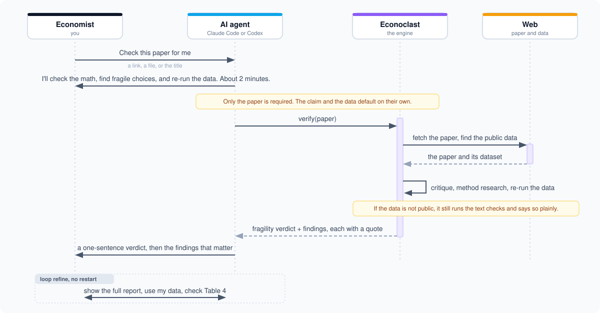

<p align="center">
  
</p>

<p align="center">
  <a href="https://github.com/shoal-rat/econoclast/actions/workflows/ci.yml"></a>
  <a href="LICENSE"></a>
  
  
  <a href="https://github.com/astral-sh/ruff"></a>
</p>

A lot of empirical papers are, underneath, a search. You pick a sample, a window, a set of controls,
a way to cluster the errors, and you keep the version that comes out significant. Then you write the
story forward as if that path was the only sensible one. Econoclast plays the other side of that
game. It re-derives the numbers in the paper, hunts for the choices that were quietly made, finds and
re-runs the data when the data is public, and tells you how much of the headline actually survives.

You are meant to ask once and let it finish. Inside Claude Code or Codex you can just say "check this
paper for me" with a link, and the agent works out what it needs, asks you in plain words for anything
missing (you do not need to know any of the tech), runs the whole thing, and explains the result in
plain language. From a terminal it is one command:

```bash
econoclast verify https://arxiv.org/abs/2401.12345
```

That downloads the paper, reads it, runs the model critique, researches any method it does not already
cover, looks in the paper for a public dataset, downloads it, works out which regression is the
headline result, and re-runs it across hundreds of defensible specifications. Out comes a fragility
score and a list of specific, quotable problems.

When a publisher or data host blocks the plain download (a 403, a Cloudflare or JavaScript wall, a
cookie gate), Econoclast does not give up and it does not carry its own browser. It hands the job to
the agent it runs on: Claude Code or Codex drives its own browser, or uses curl with the right
cookies, or searches the web for the source, and saves the file. Econoclast directs; the agent does
the work with its own tools.

## A native-LLM tool

Econoclast is not its own model and has no offline mode. It runs on the intelligence of the agent you
already use: it drives **Claude Code** or **Codex** as a subprocess, with their subscription auth, so
there is no API key to manage and nothing to host. If neither CLI is on your PATH, Econoclast tells you
to install one rather than degrading to something weaker.

What it produces is one set of adversarial critiques, written by the model and held to a hard rule:
specification search, cherry-picked samples and windows, weak identification, missing robustness
checks, hypotheses that look invented after the fact, and claims the evidence does not support. Every
finding has to quote the paper, a mechanical check confirms the quote is really there, the score
discounts anything left unquoted, and a separate referee pass turns the pile into one verdict.

Think of Econoclast as the boss and the agent as the worker. Econoclast decides what needs doing and
hands each job to the agent: read the paper and pull out the design, claim, and data (one reader); run
the critique as several independent reviewers at once; for a method it does not cover, go research it
and check the paper against it; on `--deep`, run rival verification strategies and have a judge keep
the best; and when a download is blocked, get past the wall with a browser. Econoclast sets the task,
holds every answer to a quote, and merges the results. The agent does the work.

## Install

One command installs everything and registers the agent tool:

```bash
curl -fsSL https://raw.githubusercontent.com/shoal-rat/econoclast/main/install.sh | bash
```

Or with pip (you also need Claude Code or Codex installed and logged in):

```bash
pip install "econoclast[all] @ git+https://github.com/shoal-rat/econoclast"
econoclast setup     # detect Claude Code / Codex, write the config, register the MCP tool
econoclast backend   # check which agent it will use
```

For the blocked-download fallback, the agent fetches the file with whatever tools it has. Giving your
Claude Code or Codex a browser (for example the Playwright MCP, or Claude in Chrome) lets it get past
heavier anti-crawler walls; with no browser it still tries curl and a web search. Turn the whole
fallback off with `agent_download: false` in `econoclast.yaml`.

## Commands

| Command | What it does |
|---|---|
| `econoclast verify <path or URL>` | the whole pipeline: read, critique, fetch the data, re-run it |
| `econoclast review <path or URL>` | the model critique, no data step |
| `econoclast replicate <spec.yaml>` | specification curve plus McCrary / Callaway-Sant'Anna from a config |
| `econoclast reproduce <package>` | run the authors' own code (opt-in, untrusted) |
| `econoclast batch <folder>` | review a folder of papers and rank them by fragility |
| `econoclast setup` | detect your backend, write the config, register the agent tool |
| `econoclast mcp` | run the MCP server so Claude Code / Codex can call Econoclast |
| `econoclast ui` | the Streamlit web app |
| `econoclast attacks` / `backend` | list the checks / show which agent will run |

## Inside Claude Code and Codex

You ask once and it finishes. The agent works out what it has, states what it is about to do, and only
asks you a question if it cannot find the paper. The data and the exact result default on their own.

<p align="center">
  
</p>

How that flow was designed, and the friction it removed, is written up in
[docs/interaction-design.md](docs/interaction-design.md).

If you already run one of these agents, Econoclast can use its subscription, so there is no second API
key to manage. Install once, let the agent set itself up, then talk to it.

```bash
pip install "econoclast[all] @ git+https://github.com/shoal-rat/econoclast"
econoclast setup        # detects the backend, writes config, registers the MCP tool
```

After that, say "verify https://..." inside Claude Code or Codex and the agent runs Econoclast as a
tool. There is also an `/econoclast-setup` command that asks two or three questions and runs setup for
you, and a `/plugin marketplace add shoal-rat/econoclast` plugin with an `/econoclast` slash command.
Full details in [integrations/README.md](integrations/README.md).

Or drive it from the terminal through your login, with no API key:

```bash
econoclast review paper.pdf --backend claude
econoclast review paper.pdf --backend codex
```

## What you get

A fragility score from 0 to 100 with a verdict band, the list of findings (each with a severity, a
confidence, the quote it rests on, and a suggested fix), and a short referee summary of what would
change the verdict. It renders to Markdown, JSON, and a self-contained HTML page.

```text
+-- Minimum Wages and Teen Employment -------------------------------+
| Fragility 77.9/100  Fragile                                        |
| The central claim looks fragile to plausible alternative choices.  |
| Integrity flag: a reported statistic is internally impossible.     |
+----------------------------- did, panel_fe ------------------------+
```

## The checks

Every check returns the same kind of finding, so they land in one report and one score. The model ones
must quote the paper, and they only fire when the design matches.

| Check | What it catches |
|---|---|
| specification search | researcher degrees of freedom and a headline spec chosen from many |
| cherry-picking | selective samples, windows, subgroups, outcomes, and dropped data |
| identification | parallel-trends and staggered-DiD problems, RDD manipulation, IV exclusion and weak instruments |
| robustness coverage | the standard checks that are conveniently missing |
| HARKing, over-claiming | post-hoc mechanisms and claims the design cannot support |
| literature contradiction | novelty and positioning claims checked against retrieved related work |
| methodology audit | for a method it does not cover, the identifying assumptions and diagnostics it skips |
| citation-check | references that do not resolve to a real work in Crossref |

Run `econoclast attacks` for the full list, or `--attacks cherry-picking,identification` for a subset.
With `--ensemble N` each check runs N times and only findings that recur survive. The algorithms and
references are in [docs/attacks.md](docs/attacks.md).

## It researches what it doesn't know

Economics uses too many methods to hardcode a checker for each one, so Econoclast doesn't try. It runs
the built-in checks where they apply, and for anything else it does what a careful referee does with
an unfamiliar method: looks it up, then verifies.

When a paper uses a method without a built-in test (synthetic control, a bunching estimator, a
shift-share instrument, a structural model, double machine learning), Econoclast retrieves that
method's assumptions and standard diagnostics from the literature, then checks the paper against them
instead of relying on the model's memory. Every prompt carries the same rule: do not guess; lean on
the sources; mark anything you could not verify and give it low confidence. With `--deep` it branches,
running several verification strategies and letting a judge keep the best-supported. With `--allow-code`
and a dataset in hand, it can write and run a diagnostic for a method it does not cover (off by
default, since that runs model-written code). The reasoning behind this is in
[docs/philosophy.md](docs/philosophy.md).

## Replication mode

The checks above read the PDF. They cannot tell you whether the result holds under a different but
equally reasonable specification. For that you need the data. Give Econoclast the dataset and it
re-estimates the headline coefficient across the multiverse of choices and reports the share that
survive. It runs the regressions itself with statsmodels. It never executes the authors' code unless
you ask it to.

```bash
pip install "econoclast[replication]"
econoclast replicate --init data.csv -o spec.yaml   # scaffold a config from the columns
econoclast replicate spec.yaml -o out/              # spec-curve plot, JSON, findings
```

When the design columns are present it also runs the proper design checks: a McCrary density test for
RDD manipulation, and for staggered difference-in-differences the Callaway-Sant'Anna estimator, the
Sun-Abraham event study, and a Goodman-Bacon contrast that flags when two-way fixed effects are
biased by negative weights. "Significant in 22% of 1,800 plausible specifications" says more than any
single regression table. More in [docs/replication.md](docs/replication.md).

## How it works

<p align="center">
  
</p>

The pipeline is fixed and ordered rather than an open-ended loop. The attack set is design-gated,
every model finding is tied to a quote, and a separate model pass writes the final synthesis. It
trades some autonomy for being auditable, which is the right trade for a tool whose job is rigour.
Notes in [docs/architecture.md](docs/architecture.md).

There is one backend: whichever of Claude Code or Codex it finds, used for every step. Prefer one with
`--backend claude` or `--backend codex`, or set it in `econoclast.yaml`:

```yaml
backend: claude   # auto | claude | codex
```

Details in [docs/models.md](docs/models.md).

## Keeping the review honest

Automated reviewers fail in known ways, and the research on LLM peer review is consistent about which
ones. Econoclast builds in the countermeasures it recommends, documented with citations in
[docs/credibility.md](docs/credibility.md).

Findings are grounded: each model finding carries a verbatim quote, and a mechanical check confirms
the quote is actually in the paper before the finding counts for much. Reviews run identity-blind,
because a 1,220-paper study in economics found that models rate elite and visible authors higher, so
the author block, affiliations, emails, and acknowledgements are redacted first. The manuscript is
treated as data and never as instructions, so invisible text is stripped and any embedded "give a
positive review" line is caught and flagged. The score is calibrated by severity and confidence and
saturates, so a couple of real problems outweigh a long list of nitpicks. And the output is a set of
flags for a person to check. A statistical inconsistency can be an honest typo, and Econoclast does
not accuse anyone of anything.

## Limitations

Read [docs/interpreting-reports.md](docs/interpreting-reports.md) before you quote a finding. Model
findings can be wrong, which is why each one ships with the quote it rests on and why anything unquoted
is discounted. The replication runs your specification of the multiverse, so the agent has to read the
variables off the paper correctly, and the estimators are screening tools rather than a copy of the
authors' exact pipeline. Do not paste a fragility score into a public accusation.

## Contributing

Adding a check is small: subclass `Attack`, return findings, register it. Any new statistical method
needs a known-answer test against synthetic data. See [CONTRIBUTING.md](CONTRIBUTING.md).

```bash
git clone https://github.com/shoal-rat/econoclast && cd econoclast
pip install -e ".[dev,pdf,replication]"
pytest && ruff check src tests
```

## Citation

```bibtex
@software{econoclast,
  title  = {Econoclast: an adversarial AI referee for empirical economics},
  year   = {2026},
  url    = {https://github.com/shoal-rat/econoclast}
}
```

## License

MIT. See [LICENSE](LICENSE).
