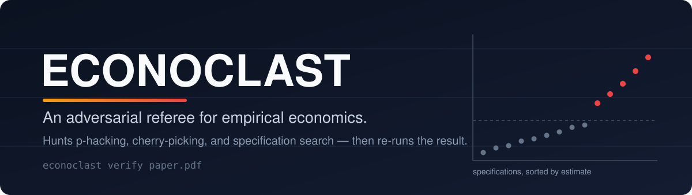
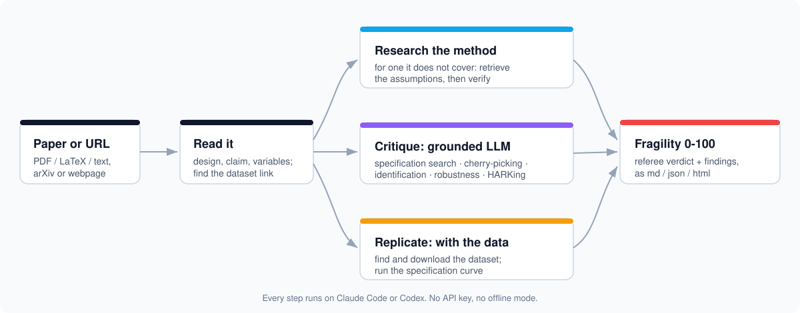

<p align="center">
  
</p>

<p align="center">
  <a href="https://github.com/shoal-rat/econoclast/actions/workflows/ci.yml"></a>
  <a href="LICENSE"></a>
  
  
  <a href="https://github.com/astral-sh/ruff"></a>
</p>

A lot of empirical papers are, underneath, a search. You pick a sample, a window, a set of controls,
a way to cluster the errors, and you keep the version that comes out significant. Then you write the
story forward as if that path was the only sensible one. Econoclast plays the other side of that
game. It re-derives the numbers in the paper, hunts for the choices that were quietly made, finds and
re-runs the data when the data is public, and tells you how much of the headline actually survives.

Point it at a paper and it does the rest:

```bash
econoclast verify https://arxiv.org/abs/2401.12345
```

That single command downloads the paper, runs the offline statistical checks, runs the model
critique, looks in the paper for a public dataset, downloads it, works out which regression is the
headline result, and re-runs it across hundreds of defensible specifications. Out comes a fragility
score and a list of specific, quotable problems.

## Two layers

The first layer is a set of statistical checks that run offline with no API key and no network.
statcheck recomputes every p-value from its test statistic. GRIM and GRIMMER catch means and standard
deviations that are impossible for integer data. p-curve, z-statistic bunching at 1.96, TIVA, Benford,
and terminal-digit tests look at the shape of the reported numbers. These are arithmetic, so a flag
here is hard to argue with.

The second layer is a set of adversarial critiques written by a model: specification search,
cherry-picked samples and windows, weak identification, missing robustness checks, hypotheses that
look invented after the fact, and claims the evidence does not support. Every finding has to quote the
paper, a mechanical check confirms the quote is really there, and a separate referee pass turns the
pile into one verdict.

You can stop at the first layer (instant, free) or add the second with any backend: OpenAI,
Anthropic, Google, OpenRouter, a local model through Ollama, or your existing Claude Code or Codex
subscription with no separate key.

## Install

```bash
# Until the PyPI release, install from the repo:
pip install "git+https://github.com/shoal-rat/econoclast"
# everything (PDF, UI, MCP, replication, LiteLLM):
pip install "econoclast[all] @ git+https://github.com/shoal-rat/econoclast"
```

Try the offline checks on the bundled demo. No keys needed:

```bash
econoclast forensics examples/demo_paper.txt
```

```text
                          Minimum Wages and Teen Employment (synthetic)
 Test       Verdict      N   Summary
 statcheck  suspicious   2   2/2 reported p-values disagree with the recomputed value, 2 flip
                             significance at .05
 grim       suspicious   1   1/1 reported means are impossible for integer data of that N
 grimmer    suspicious   1   1/1 (mean, SD, N) triples are impossible for integer data
 p-curve    suspicious   6   p-curve is flat/left-skewed: consistent with p-hacking
 caliper    suspicious  18   test statistics bunch just above the significance thresholds
```

## Commands

| Command | What it does |
|---|---|
| `econoclast verify <path or URL>` | the whole pipeline: paper, forensics, critique, fetch data, re-run it |
| `econoclast review <path or URL>` | forensics plus model critique, no data step |
| `econoclast forensics <path or URL>` | only the offline statistical checks (no key) |
| `econoclast replicate <spec.yaml>` | specification curve plus McCrary / Callaway-Sant'Anna from a config |
| `econoclast reproduce <package>` | run the authors' own code (opt-in, untrusted) |
| `econoclast batch <folder>` | review a folder of papers and rank them by fragility |
| `econoclast setup` | detect your backend, write the config, register the agent tool |
| `econoclast mcp` | run the MCP server so Claude Code / Codex can call Econoclast |
| `econoclast ui` | the Streamlit web app |
| `econoclast attacks` / `models` | list the checks / show model routing |

## Inside Claude Code and Codex

If you already run one of these agents, Econoclast can use its subscription, so there is no second API
key to manage. Install once, let the agent set itself up, then talk to it.

```bash
pip install "econoclast[all] @ git+https://github.com/shoal-rat/econoclast"
econoclast setup        # detects the backend, writes config, registers the MCP tool
```

After that, say "verify https://..." inside Claude Code or Codex and the agent runs Econoclast as a
tool. There is also an `/econoclast-setup` command that asks two or three questions and runs setup for
you, and a `/plugin marketplace add shoal-rat/econoclast` plugin with an `/econoclast` slash command.
Full details in [integrations/README.md](integrations/README.md).

Or drive it from the terminal through your login, with no API key:

```bash
econoclast review paper.pdf --backend claude
econoclast review paper.pdf --backend codex
```

## What you get

A fragility score from 0 to 100 with a verdict band, the list of findings (each with a severity, a
confidence, the quote it rests on, and a suggested fix), the full forensic battery, and a short
referee summary of what would change the verdict. It renders to Markdown, JSON, and a self-contained
HTML page.

```text
+-- Minimum Wages and Teen Employment -------------------------------+
| Fragility 77.9/100  Fragile                                        |
| The central claim looks fragile to plausible alternative choices.  |
| Integrity flag: a reported statistic is internally impossible.     |
+----------------------------- did, panel_fe ------------------------+
```

## The checks

Every check returns the same kind of finding, so statistics and model reasoning land in one report and
one score. The deterministic ones need no key. The model ones must quote the paper, and they only fire
when the design matches.

| Check | Kind | What it catches | Needs a model |
|---|---|---|---|
| statcheck | deterministic | a reported p that disagrees with its own test statistic, especially when it flips significance | no |
| GRIM / GRIMMER | deterministic | means and SDs that no integer data of that N can produce | no |
| p-curve | deterministic | a flat or left-skewed curve of significant p-values | no |
| caliper | deterministic | z-statistics piled up just above 1.96, 1.645, or 2.576 | no |
| TIVA, R-index | deterministic | z-scores too alike to be independent; an inflated success rate | no |
| Benford, terminal-digit | deterministic | first-digit anomalies and rounding/heaping in the numbers | no |
| citation-check | network | references that do not resolve to a real work in Crossref | no |
| specification search | model | researcher degrees of freedom and a headline spec chosen from many | yes |
| cherry-picking | model | selective samples, windows, subgroups, outcomes, and dropped data | yes |
| identification | model | parallel-trends and staggered-DiD problems, RDD manipulation, IV exclusion and weak instruments | yes |
| robustness coverage | model | the standard checks that are conveniently missing | yes |
| HARKing, over-claiming | model | post-hoc mechanisms and claims the design cannot support | yes |
| literature contradiction | model | novelty and positioning claims checked against retrieved related work | yes |

Run `econoclast attacks` for the list, or `--attacks statcheck,caliper` for a subset. With
`--ensemble N` each model check runs N times and only findings that recur survive. The algorithms and
references are in [docs/attacks.md](docs/attacks.md).

## Replication mode

The checks above read the PDF. They cannot tell you whether the result holds under a different but
equally reasonable specification. For that you need the data. Give Econoclast the dataset and it
re-estimates the headline coefficient across the multiverse of choices and reports the share that
survive. It runs the regressions itself with statsmodels. It never executes the authors' code unless
you ask it to.

```bash
pip install "econoclast[replication]"
econoclast replicate --init data.csv -o spec.yaml   # scaffold a config from the columns
econoclast replicate spec.yaml -o out/              # spec-curve plot, JSON, findings
```

When the design columns are present it also runs the proper design checks: a McCrary density test for
RDD manipulation, and for staggered difference-in-differences the Callaway-Sant'Anna estimator, the
Sun-Abraham event study, and a Goodman-Bacon contrast that flags when two-way fixed effects are
biased by negative weights. "Significant in 22% of 1,800 plausible specifications" says more than any
single regression table. More in [docs/replication.md](docs/replication.md).

## How it works

<p align="center">
  
</p>

The pipeline is fixed and ordered rather than an open-ended loop. The attack set is design-gated,
every model finding is tied to a quote, and a separate model writes the final synthesis. It trades
some autonomy for being auditable, which is the right trade for a tool whose job is rigour. Notes in
[docs/architecture.md](docs/architecture.md).

Models are addressed by role, not by name. An attack asks for `extractor`, `attacker`, or `referee`,
and the router resolves it to a model with a fallback and keeps a running cost. Configure it in
`econoclast.yaml`:

```yaml
models:
  extractor: anthropic:claude-haiku-4-5-20251001
  attacker:
    - anthropic:claude-opus-4-8
    - openai:gpt-4o
  referee: anthropic:claude-opus-4-8
```

Point a role at a local model with `{ provider: ollama, model: "llama3.1:70b" }`, or hand everything
to [LiteLLM](https://github.com/BerriAI/litellm). Details in [docs/models.md](docs/models.md).

## Keeping the review honest

Automated reviewers fail in known ways, and the research on LLM peer review is consistent about which
ones. Econoclast builds in the countermeasures it recommends, documented with citations in
[docs/credibility.md](docs/credibility.md).

Findings are grounded: each model finding carries a verbatim quote, and a mechanical check confirms
the quote is actually in the paper before the finding counts for much. Reviews run identity-blind,
because a 1,220-paper study in economics found that models rate elite and visible authors higher, so
the author block, affiliations, emails, and acknowledgements are redacted first. The manuscript is
treated as data and never as instructions, so invisible text is stripped and any embedded "give a
positive review" line is caught and flagged. The score is calibrated by severity and confidence and
saturates, so a couple of real problems outweigh a long list of nitpicks. And the output is a set of
flags for a person to check. A statistical inconsistency can be an honest typo, and Econoclast does
not accuse anyone of anything.

## Limitations

Read [docs/interpreting-reports.md](docs/interpreting-reports.md) before you quote a finding. The
distribution tests are weak on small samples and assume conditions a single paper may not satisfy;
they are capped at low confidence and printed with their caveats. Model findings can be wrong, which
is why each one ships with the quote it rests on. The replication runs your specification of the
multiverse, so the agent has to read the variables off the paper correctly, and the estimators are
screening tools rather than a copy of the authors' exact pipeline. Do not paste a fragility score into
a public accusation.

## Roadmap

- [x] Specification-curve and multiverse replication, re-estimated in process
- [x] McCrary density test, Callaway-Sant'Anna and Sun-Abraham, Goodman-Bacon diagnostic
- [x] Mechanical citation verification against Crossref
- [x] Multi-model ensemble voting on findings
- [x] One-line `verify`: fetch the paper, find and download the data, run everything
- [x] Runs inside Claude Code and Codex, no API key; takes a path or a URL
- [x] GROBID ingestion, opt-in author-code reproduction, and batch mode over a folder
- [ ] Cattaneo-Jansson-Ma (`rddensity`) and doubly-robust Callaway-Sant'Anna with covariates
- [ ] A proper container sandbox for author-code reproduction
- [ ] PyPI release and a hosted demo

## Contributing

Adding a check is small: subclass `Attack`, return findings, register it. Any new statistical method
needs a known-answer test against synthetic data. See [CONTRIBUTING.md](CONTRIBUTING.md).

```bash
git clone https://github.com/shoal-rat/econoclast && cd econoclast
pip install -e ".[dev,pdf,replication]"
pytest && ruff check src tests
```

## Citation

```bibtex
@software{econoclast,
  title  = {Econoclast: an adversarial AI referee for empirical economics},
  year   = {2026},
  url    = {https://github.com/shoal-rat/econoclast}
}
```

## License

MIT. See [LICENSE](LICENSE).
