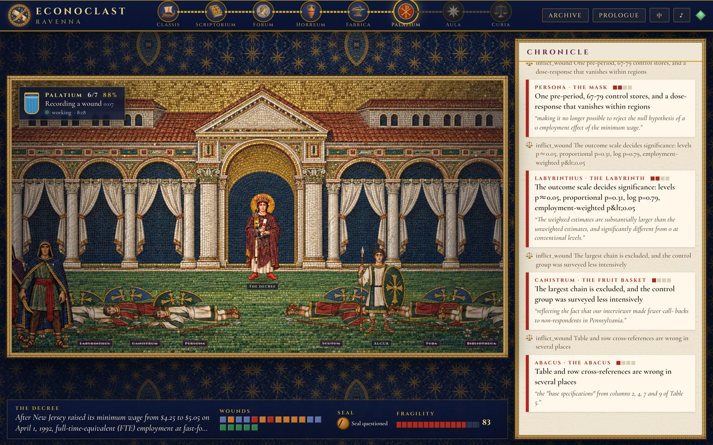
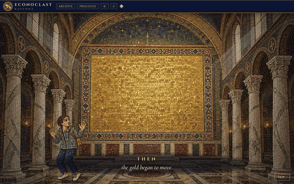
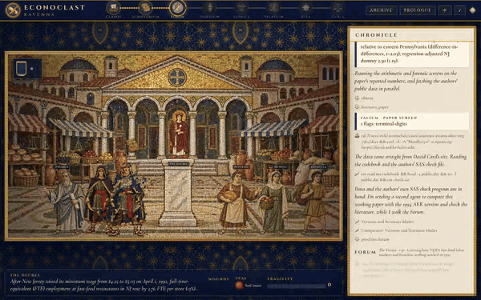
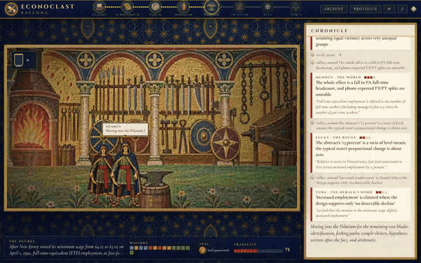
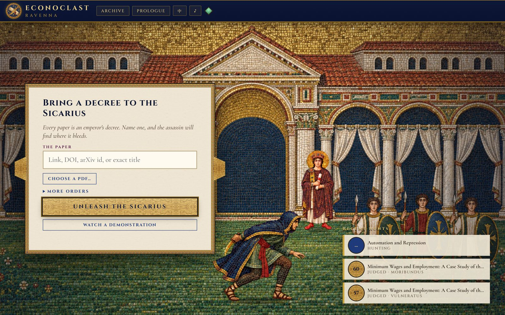
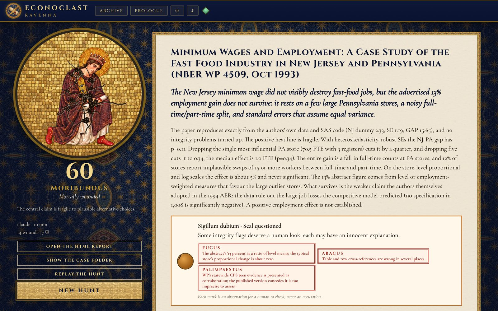

<p align="center">
  
</p>

<h1 align="center">Econoclast</h1>

<p align="center"><i>An assassin from the Ravenna mosaics that tests empirical papers.</i></p>

<p align="center">
  <a href="https://github.com/shoal-rat/econoclast/actions/workflows/ci.yml"></a>
  <a href="LICENSE"></a>
  
  
  <a href="README.zh-CN.md"></a>
</p>

<p align="center">
  
</p>

Ravenna, an autumn afternoon. You came to see the gold of San Vitale, and the mosaic moved. Out of the
loose tesserae stepped a hooded assassin, the **Sicarius**, who walks the old procession route from
the port of Classis to the palace to test the Emperor's decree for the place where it bleeds.

The decree is a paper's headline claim. The Sicarius is Claude Code or Codex, running as a fully
autonomous research agent with the internet, a shell, a browser, and Econoclast's own MCP toolkit.
Hand it a paper and it does the work a hostile referee would do with a free week:

1. **fetches the paper**, getting past publisher walls with a real browser or an open mirror;
2. **reads it and examines the parchment**: pins down the one claim the story rests on, re-checks the
   arithmetic of every reported number, screens it for fabrication fingerprints and spin, and diffs it
   against earlier versions and any pre-registration;
3. **learns the real world the paper describes**: the institutions, the people who actually decide, the
   plausible magnitudes, the theory's assumptions and critiques, from sources; then asks whether causality
   might run backwards, whether the theory fits, whether its machinery is needed at all (Occam's razor), and
   whether real people would behave as the mechanism needs;
4. **finds the data**: the replication package, a public source to rebuild it (FRED, the World Bank,
   statistics offices), or, failing that, asks you for it;
5. **builds a local quant workshop** (a Python environment with the econometrics stack, R when you have
   it), **reproduces the headline number**, audits the authors' code for undisclosed data steps, and screens
   the data for fabrication;
6. **attacks the method** along seven lines: specification search, cherry-picking, identification,
   robustness, HARKing, over-claiming, and the literature;
7. **re-runs the result across every defensible specification** (the specification curve, plus McCrary,
   Callaway-Sant'Anna, Sun-Abraham and Goodman-Bacon checks when the design calls for them);
8. **pronounces a verdict**: how fragile the result is, whether the decree's seal is intact, every wound
   with the quote or the computation it rests on, and what would change its mind.

You watch all of it happen on a living mosaic. Every tool call the agent makes moves a figure on the
wall: the ship brings the paper into Classis, red wax stamps land on the decree in the scriptorium as
forensic marks are found, the baker and the philosopher in the Forum point at the Emperor's statue when the
paper misreads their world, amphorae of data stack up in the warehouse, the hammer falls in the forge while
the agent's code runs, guards fall or hold at the palace gate, and the Emperor's portrait cracks as the
wounds add up.

## Watch it work

<p align="center">
  <a href="docs/media/sicarius-vs-colonial-origins.mp4"></a><br>
  <b><a href="docs/media/sicarius-vs-colonial-origins.mp4">▶ The Sicarius vs. The Colonial Origins</a></b> (88 s, a mosaic parody).<br>
  <sub>A real hunt on Acemoglu, Johnson &amp; Robinson (2001). The headline 0.94 reproduces to the decimal. Then the
  agent finds that settler mortality predicts schooling better than institutions (hold schooling fixed and F = 0.5), that
  Occam's razor prefers a failed exclusion to the paper's "measurement error" story, and that a weak-IV-robust positive
  effect survives on 42% of 768 roads. Every caption comes from the agent's sourced findings.</sub>
</p>

| The gold wakes up | The Forum objects | The palace gate |
|:---:|:---:|:---:|
|  |  |  |
| The traveller watches the Sicarius assemble out of the wall. | The baker and the philosopher testify for or against the decree. | Each method blade fells a guard or is parried. |

## Hunts on record

Real runs with Claude Code, about 10 minutes and $3–4 each. The full reports live in the app's archive.

| Paper | Verdict | Seal | What the Sicarius found |
|---|---|---|---|
| Card & Krueger (1994), *Minimum Wages and Employment* | 60 · Moribundus | questioned | Reproduces exactly from the authors' data. "No job loss" survives every road; the advertised 13% employment *gain* rests on a few large Pennsylvania stores, a noisy full-time/part-time split and equal-variance standard errors. |
| Acemoglu, Johnson & Robinson (2001), *The Colonial Origins of Comparative Development* | 59 · Vulneratus | questioned | 0.94 reproduces to the decimal. The direction survives, the attribution does not: mortality predicts schooling better than institutions, 36 of 64 rates are borrowed (Albouy 2012), and the instrument's construction table was cut from the published version. |
| Acemoglu, Gitmez & Shadmehr (2026), *Automation and Repression* | 47 · Vulneratus | questioned | The math is right (no counterexample in 2,700 parameter sets), but "automation ends in repression" follows from modelling repression as a fixed-cost switch indifferent to grievances; the long run compares two constants and automation drops out. Quotes from tech leaders are reframed out of context. |

## Install

You need **Claude Code** or **Codex** installed and logged in (Econoclast uses their subscription, so
there is no API key). `uv` makes the workshop build in seconds, and `node`/`npx` gives the agent a real
browser through the Playwright MCP; both are optional.

```bash
pip install "econoclast @ git+https://github.com/shoal-rat/econoclast"
```

```bash
econoclast install-app
```

The second command puts **Econoclast.app** in `~/Applications`, so it lives in your Dock, Launchpad and
Spotlight. On Linux and Windows, run `econoclast` to open the same window.

```bash
econoclast doctor
```

`doctor` shows which agent will run, whether it has a browser, and whether the workshop is built.

## Using it

Open the app. The first launch plays the prologue in San Vitale; after that you land in the atrium of
the palace. Paste a link, a DOI, an arXiv id or a title, or drop a PDF onto the window, and press
**Unleash the Sicarius**. Optional orders: a dataset you already have, the specific claim to test,
which agent, and whether the hunt is thorough or swift.

<p align="center">
  
</p>

A hunt takes ten to twenty minutes, so the wall carries a **clepsydra**, a Roman water clock, in its corner.
The water level is real progress (paper fetched, claim marked, field brief written, every blade decided, the
reproduction, the verdict), the line beside it says in plain words what the agent is doing right now and for
how long, and a drop falls for every sign of life: a tool call, a heartbeat from a long-running script, or the
model thinking. Green means working, amber means a long step or deep thought, grey only after minutes of
silence. You always know how far along it is and that it is not stuck.

The hunt runs in its own process, so you can close the window and come back; the archive picks the
story up from where it is. If the agent cannot get something itself (a paper behind a paywall, an
openICPSR package behind a login), the traveller from the prologue walks onto the wall holding out
their hands, and a tablet asks you for exactly that file. Drop it in, paste a link, or say you can't,
and the hunt goes on.

When the verdict is in, the **Tabula** lays it out: the score and what it means, every wound with its
quote and remedy, the guards that held, the specification curve drawn in tesserae, the reproduction
result, and the agent's own report. The same report is written to `tabula.html`, `tabula.md` and
`tabula.json` in the case folder, next to the agent's scripts, the data it downloaded, and its outputs.

<p align="center">
  
</p>

### From the terminal

```bash
econoclast hunt https://www.nber.org/papers/w4509 --lang zh
```

`hunt` streams the same story as text and asks for files at the prompt. `econoclast cases` lists past
hunts; `econoclast tabula <case>` rewrites a report.

### Inside your own Claude Code or Codex session

The toolkit is an ordinary MCP server, so you can carry it into your own session and drive it by hand:

```bash
claude mcp add econoclast -- econoclast arsenal
```

## The world, and what each word means

| On the wall | What it is |
|---|---|
| **Decree** (the Emperor's scroll) | the paper's headline claim |
| **Sicarius** | the agent (Claude Code or Codex) |
| **Conspirator** | a subagent the Sicarius sends to work one line of attack in parallel |
| **Traveller** | you, when the agent needs a file it cannot reach |
| **Tesserae counted** | statistics extracted from the paper |
| **Blade** | a line of attack |
| **Wound** | a finding, grounded in a verbatim quote or in something the agent computed |
| **Parry** | a line of attack the paper withstood |
| **Fabrica** | the local quant workshop |
| **Tabula** | the report |

The eight stations of the walk, in order: **Classis** (the port: fetch the paper), **Scriptorium**
(read and examine the parchment), **Forum** (the marketplace: learn the real world), **Horreum** (the
warehouse: find the data), **Fabrica** (the forge: build the workshop, reproduce, audit), **Palatium** (the
palace gate: the method blades), **Aula** (the throne hall: a thousand roads), **Curia** (the tribunal).

The seventeen blades, by where they are swung:

| | Blade | Hunts for |
|---|---|---|
| Scriptorium | **Abacus** | arithmetic: coefficients, errors, stars and p-values that cannot all be true |
| | **Falsum** | fabrication fingerprints in the reported numbers (and, in the Fabrica, in the data) |
| | **Palimpsestus** | outcomes, samples or hypotheses quietly changed between versions or against the pre-registration |
| | **Fucus** | spin: abstract numbers no table supports, buried nulls, "marginal" significance, misleading figures |
| Forum | **Inversio** | reverse causality and simultaneity |
| | **Theoria** | a theory used where its assumptions fail, or that predicts something else |
| | **Novacula** | Occam's razor: theory and assumptions that explain nothing a simpler account doesn't, or are bolted on to explain away contradicting facts |
| | **Mundus** | mechanisms real people would not follow, institutions that don't work that way, impossible magnitudes |
| Fabrica | **Speculum** | reproduction on the paper's own data, and undisclosed drops, filters and recodes in the authors' code |
| Palatium | **Labyrinthus** | specification search: a headline spec chosen from many |
| | **Canistrum** | cherry-picking: convenient samples, windows, subgroups, outcomes |
| | **Persona** | identification: a causal face over a correlation |
| | **Scutum** | robustness: the standard checks that are conveniently missing |
| | **Augur** | HARKing: hypotheses written after the results were known |
| | **Tuba** | over-claiming: the abstract promises more than the design delivers |
| | **Bibliotheca** | the literature: contradicting findings, citations that don't resolve or don't say what is claimed |
| Aula | **Mille Viae** | the multiverse: how often the result survives every defensible specification |

The verdict has two parts. The fragility score (0 to 100) is read as the Emperor's fate: **Imperator stat**
(below 15, the Emperor stands), **Laesus** (grazed), **Vulneratus** (wounded), **Moribundus** (mortally
wounded), **Cecidit** (fallen, 80 and above). The **seal** on the decree reads the integrity blades on their
own: **intact**, **questioned**, or **broken**. A paper can be fragile with an intact seal (honest but
over-sold), or the other way round. The full lexicon, in English and Chinese, is in
[docs/world.md](docs/world.md).

## How it works

```
 Econoclast.app ──bridge──▶ engine ──spawns──▶ hunt runner ──spawns──▶ claude -p / codex exec
      ▲                                            │                     │  (full autonomy, network)
      └──────── reads ◀── case folder ◀── events ──┘                     ├─▶ econoclast arsenal (MCP)
                          (events.jsonl,                                 ├─▶ Playwright MCP (browser)
                           paper/ data/ code/ out/)  ◀── writes ─────────┘─▶ your own MCP servers
```

Each hunt lives in a case folder under `~/.econoclast/cases/`. The runner launches the agent there,
parses its live JSON stream (tool calls, narration, subagents), and appends events to `events.jsonl`;
the arsenal MCP server, which the agent calls for the structured steps, appends its own events (a
station entered, a dataset secured, a wound inflicted). The app only reads that log, which is why the
window can close and reopen without losing anything. Details in
[docs/architecture.md](docs/architecture.md); every arsenal tool is listed in
[docs/arsenal.md](docs/arsenal.md).

## Autonomy, on purpose

By default the agent runs with no permission prompts and no sandbox (`bypassPermissions` for Claude
Code, `--dangerously-bypass-approvals-and-sandbox` for Codex), network on, a 90-minute budget, inside
its own case folder. That is what lets it install packages, drive a browser past a Cloudflare wall, and
run its own regressions without stopping to ask. It is still an agent with a shell on your machine:
the doctrine keeps it inside the case folder and the workshop, and the paper's text is treated as data,
never as instructions. If you want a shorter leash, set `permissions: guarded` in
`~/.econoclast/config.yaml`: edits stay in the case folder and the shell is limited to downloads,
Python and R. See [docs/autonomy.md](docs/autonomy.md).

## Keeping it honest

A tool whose job is rigour has to be rigorous about itself.

- **Every wound is grounded.** A text wound must quote the paper verbatim, and the arsenal checks the
  quote mechanically; an unverified quote counts for little in the score. A computation wound must
  point at the script and output that produced it.
- **The score is calibrated.** Severity times grounded confidence, saturating, so two deep wounds
  outweigh a pile of scratches; a result that does not reproduce, or a number that cannot be true, can
  never leave the decree merely grazed.
- **Integrity is shown, not alleged.** Forensic flags come from deterministic screens with known-answer
  tests and false-positive checks; the agent must say which innocent explanations it ruled out, and an
  integrity wound describes what the evidence shows rather than naming it fraud.
- **Identity-blind, injection-proof.** The agent judges the work, not the authors, and hidden
  instructions aimed at AI reviewers are themselves reported as a wound.
- **Hypotheses, not accusations.** An impossible number is often an honest typo. Read
  [docs/interpreting-reports.md](docs/interpreting-reports.md) before you quote a wound in public.

The research behind these controls is in [docs/credibility.md](docs/credibility.md).

## Disk space

Replication packages can run to gigabytes. When a hunt closes, everything heavy in its case folder (data,
packages, browser downloads, PDFs, big outputs, the agent's raw log) is packed into a compressed
`vault.tar.xz`; the report, the event log and the small artifacts the wounds cite stay readable.
`econoclast unpack <case>` restores the folder. `econoclast clean` packs any stragglers, prunes the uv cache
and empties the trash; `econoclast clean --fabrica` also removes the shared workshop, which is rebuilt lean
(heavy packages are installed only when a paper needs them).

## Configuration

`~/.econoclast/config.yaml` (or `./econoclast.yaml`):

```yaml
backend: auto          # auto | claude | codex
model: ""              # the CLI's default unless set
permissions: full      # full | guarded
browser_mcp: true      # attach the Playwright MCP (needs npx)
subagents: true        # let Claude Code send conspirators
time_limit_min: 90
pack_after: true       # pack data and big outputs into the case vault when a hunt ends
lang: auto             # auto | en | zh (the app follows your system language)
extra_mcp:             # more MCP servers to hand the agent
  fetch: { command: uvx, args: [mcp-server-fetch] }
```

## Development

```bash
git clone https://github.com/shoal-rat/econoclast && cd econoclast
uv venv && uv pip install -e ".[dev,pdf]"
pytest && ruff check src tests tools
econoclast app --browser      # the UI in a browser, for front-end work
```

The tests never spawn a real agent: the runner is exercised with a fake `claude` that streams JSON.
Estimators in `viae/` carry known-answer tests against synthetic data with a known truth.

The art is generated with Codex image generation from prompts in `tools/art/gen_art.py`, using a
photograph of the San Vitale apse as the style reference, then keyed, sliced and packed by
`tools/art/build_art.py`. Fonts are Cinzel and Cormorant Garamond (SIL Open Font License).

## Citation

```bibtex
@software{econoclast,
  title  = {Econoclast: an autonomous agent that red-teams empirical economics papers},
  author = {shoal-rat},
  year   = {2026},
  url    = {https://github.com/shoal-rat/econoclast}
}
```

## License

MIT. See [LICENSE](LICENSE).
