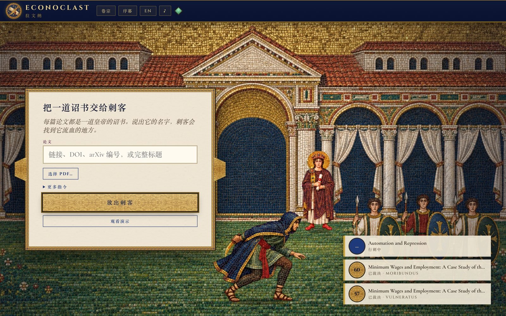
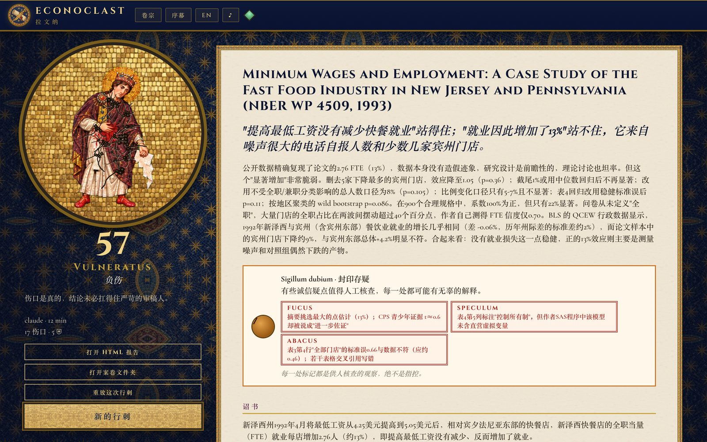

<p align="center">
  
</p>

<h1 align="center">Econoclast</h1>

<p align="center"><i>从拉文纳马赛克里走出来的刺客，专门给实证论文找茬。</i></p>

<p align="center"><a href="README.md">English</a></p>

<p align="center">
  
</p>

拉文纳，一个秋日的午后。你来圣维塔莱教堂看金色马赛克，墙上的画动了起来。散落的镶片聚拢成一个披着兜帽的刺客，**Sicarius**。
他沿着古老的游行路线，从克拉塞港一路走到皇宫，去检验皇帝的诏书，找到它流血的地方。

诏书就是一篇论文的核心结论。刺客就是 Claude Code 或 Codex，作为完全自主的研究智能体运行：能上网、有 shell、有浏览器，
还带着 Econoclast 自己的一整套 MCP 工具。把论文交给它，它会做一个苛刻审稿人花一周才做得完的事：

1. **取得论文**：出版商拦截时，用真正的浏览器绕过去，或者找开放版本；
2. **通读并检验这张羊皮纸**：锁定整篇文章押上全部的那条结论，重新核算每个数字，筛查伪造的指纹与粉饰，并和早先版本、预注册逐条比对；
3. **了解论文所描述的真实世界**：制度、真正做决定的人、合理的数量级、理论的假设与批评，都从资料里学；然后追问因果是否颠倒、理论是否适用、这套理论机器到底有没有必要（奥卡姆剃刀）、真实的人会不会照这个机制行事；
4. **找数据**：作者的复现包，能重建数据的公开来源（FRED、世界银行、各国统计局），实在拿不到就向你求援；
5. **在本地搭建量化工坊**（装好计量工具链的 Python 环境，有 R 也会用），**把核心数字复现出来**，审计作者代码里没交代的数据操作，并筛查数据造假；
6. **从七条方法线进攻**：设定搜索、挑樱桃、识别策略、稳健性、事后假设、过度宣称、文献；
7. **在所有说得过去的设定下重跑结果**（设定曲线；按研究设计加做 McCrary、Callaway-Sant'Anna、Sun-Abraham、Goodman-Bacon 检验）；
8. **宣读裁决**：结论有多脆弱、诏书的封印是否完好、每道伤口依据的引语或计算，以及什么证据能让它改判。

整个过程都在一面活的马赛克墙上演。刺客每调用一次工具，墙上的人物就动一下：船把论文运进克拉塞港，缮写室里每发现一处诚信疑点，诏书上就盖下一枚红色火漆印，
广场上的面包师和哲人在论文误读他们的世界时指向皇帝的雕像，数据像双耳陶罐一样在仓廪里堆起来，代码运行时工坊里的铁锤落下，宫门守卫倒下或举盾，伤口越多，皇帝像上的裂痕就越深。

## 看它干活

<p align="center">
  <a href="docs/media/ravenna-roast-zh.mp4"></a><br>
  <b><a href="docs/media/ravenna-roast-zh.mp4">▶ 拉文纳吐槽大会</a></b>（2 分 25 秒，请开声音）· <a href="docs/media/ravenna-roast-en.mp4">English</a><br>
  <sub>一场对 Acemoglu、Johnson 与 Robinson（2001）的脱口秀式吐槽，素材全部剪自一次真实行刺：合成的主持人配音、原创的蹑手蹑脚配乐、
  每个梗后面的“咚咚锵”、裁决前的鼓点和最后的悲伤长号。核心系数 0.94 一位不差地复现，造假信号为零；然后梗自己就来了：
  64 个死亡率里有 36 个是从别国借来的（Albouy），控制住教育后第一阶段 F 值只剩 0.5，奥卡姆剃刀认为“排他性不成立”比论文的
  “测量误差”故事更简单，投资风险评分差一分就值 2.6 倍收入差距，而 768 条道路中只有 42% 给出稳健的正效应。
  每个梗都落在一道有来源的伤口上；每道伤口都是待核查的假设，不是指控。</sub>
</p>

| 金色苏醒 | 广场上的人有话要说 | 宫门之战 |
|:---:|:---:|:---:|
|  |  |  |
| 旅人看着刺客从墙上的镶片里聚拢成形。 | 面包师和哲人为诏书作证，或者反对它。 | 每一把方法之刃，要么砍倒一名守卫，要么被挡下。 |

## 行刺记录

以下是用 Claude Code 跑出的真实结果，每次约 10 分钟、3–4 美元。完整报告在应用的卷宗里。

| 论文 | 裁决 | 封印 | 刺客的发现 |
|---|---|---|---|
| Card 与 Krueger（1994），《最低工资与就业》 | 60 · 重伤垂危 | 存疑 | 用作者数据精确复现。“没有减少就业”在所有道路上都站得住；摘要宣传的“就业增加 13%”只靠几家大的宾州门店、噪声很大的全职/兼职拆分和等方差标准误撑着。 |
| Acemoglu、Johnson 与 Robinson（2001），《比较发展的殖民起源》 | 59 · 负伤 | 存疑 | 0.94 一位不差地复现。方向站得住，归因站不住：死亡率预测教育比预测制度还准，64 个死亡率中 36 个是借来的（Albouy 2012），工具变量的构造表在发表版里被删掉了。 |
| Acemoglu、Gitmez 与 Shadmehr（2026），《自动化与镇压》 | 47 · 负伤 | 存疑 | 数学全部成立（2700 组参数无一反例），但“自动化终将导致镇压”来自把镇压设成一个与民怨无关、成本固定的开关；长期只是在比较两个常数，自动化本身并不起作用。文中科技领袖的引语被脱离原语境改写。 |

## 安装

需要先装好并登录 **Claude Code** 或 **Codex**（用的是它们的订阅，不需要 API key）。有 `uv` 的话工坊几秒就能建好；
有 `node`/`npx` 的话，刺客能通过 Playwright MCP 用上真正的浏览器。这两样都是可选的。

```bash
pip install "econoclast @ git+https://github.com/shoal-rat/econoclast"
```

```bash
econoclast install-app
```

第二条命令会把 **Econoclast.app** 装进 `~/Applications`，之后可以从程序坞、启动台和聚焦搜索打开。Linux 和 Windows 上直接运行 `econoclast` 打开同一个窗口。

```bash
econoclast doctor
```

`doctor` 会告诉你会派哪个刺客、有没有浏览器、工坊建好了没有。

## 使用

打开应用。第一次启动会播放圣维塔莱教堂里的序幕，之后直接进入皇宫中庭。粘贴链接、DOI、arXiv 编号或标题，或者把 PDF 拖进窗口，
然后点**放出刺客**。可选的指令有：你手头已有的数据、要重点检验的结论、派哪个刺客、彻查还是速战。

<p align="center">
  
</p>

一次行刺要十到二十分钟，所以墙角放着一个**漏壶**（罗马水钟）。水位是真实的进度（论文到手、诏书锁定、现实简报写好、每一把刃有了结果、复现、裁决），
旁边一行字用大白话说明刺客此刻在做什么、做了多久；刺客每有一点动静（一次工具调用、长脚本的心跳、模型在思考），就有一滴水落下。
绿灯是在干活，黄灯是长步骤或深度思考，只有几分钟毫无动静才会变灰。进行到哪了、有没有卡住，一眼就知道。

行刺在独立的进程里运行，关掉窗口再打开也不会丢；卷宗会从当前进度接着讲。刺客自己拿不到的东西（付费墙后面的论文、要登录的 openICPSR 复现包），
序幕里的那位旅人会走上墙、伸出双手，同时弹出一块石碑，告诉你它到底需要哪个文件。拖进来、贴个链接，或者说你也拿不到，行刺都会继续。

裁决出来后，**判词（Tabula）** 会摊开所有内容：分数和它的含义，每道伤口的引语和补救建议，挡下刀的守卫，用镶片画出的设定曲线，复现结果，
以及刺客自己写的报告。同一份报告也会写成案卷文件夹里的 `tabula.html`、`tabula.md`、`tabula.json`，旁边是刺客写的脚本、下载的数据和输出。

<p align="center">
  
</p>

### 在终端里

```bash
econoclast hunt https://www.nber.org/papers/w4509 --lang zh
```

`hunt` 用文字讲同一个故事，需要文件时在终端里问你。`econoclast cases` 列出历史行刺，`econoclast tabula <case>` 重写报告。

### 在你自己的 Claude Code 或 Codex 会话里

这套工具就是一个普通的 MCP 服务器，可以直接接到你自己的会话里手动使用：

```bash
claude mcp add econoclast -- econoclast arsenal
```

## 世界观与名词

| 墙上的东西 | 实际是什么 |
|---|---|
| **诏书**（皇帝手里的卷轴） | 论文的核心结论 |
| **刺客 Sicarius** | 智能体（Claude Code 或 Codex） |
| **同谋** | 刺客派出去并行攻击某一条线的子智能体 |
| **旅人** | 你，在刺客需要它拿不到的文件时 |
| **清点镶片** | 从论文里抽取出的统计量 |
| **刃** | 一条攻击线 |
| **伤口** | 一个发现，依据是原文引语或刺客算出来的东西 |
| **格挡** | 论文顶住了的攻击线 |
| **工坊 Fabrica** | 本地量化环境 |
| **判词 Tabula** | 报告 |

八站路线依次是：**克拉塞港**（取论文）、**缮写室**（读论文、检验羊皮纸）、**广场**（了解真实世界）、**仓廪**（找数据）、
**兵器工坊**（搭环境、复现、审计）、**宫门**（方法七刃）、**王座厅**（千条道路）、**元老院**（裁决）。

十七把刃，按挥出的地方分：

| | 刃 | 找的是 |
|---|---|---|
| 缮写室 | 算盘 Abacus | 算术：系数、标准误、星号、p 值彼此对不上 |
| | 伪造 Falsum | 报告数字里（以及工坊里的数据中）编造与篡改的指纹 |
| | 改写 Palimpsestus | 在不同版本之间、或相对预注册，悄悄换掉的结果变量、样本与假设 |
| | 粉饰 Fucus | 表格里找不到的摘要数字、被埋掉的零结果、“边际显著”、误导性的图 |
| 广场 | 倒置 Inversio | 倒因为果、互为因果 |
| | 理论 Theoria | 理论用在假设不成立的地方，或者它本来预测的是另一回事 |
| | 剃刀 Novacula | 奥卡姆剃刀：比更简单的解释多不出任何解释力的理论与假设，或者为了把相反事实圆过去而硬加的东西 |
| | 现实 Mundus | 真实的人不会这样行事，制度并非如此运作，数量级不可能 |
| 兵器工坊 | 铜镜 Speculum | 用论文自己的数据复现，并审读作者代码里没交代的删样本、筛选与重编码 |
| 宫门 | 迷宫 Labyrinthus | 设定搜索：从一堆设定里挑出显著的那一个 |
| | 果篮 Canistrum | 挑樱桃：恰到好处的样本、时间窗、子群体、结果变量 |
| | 面具 Persona | 识别策略：罩在相关性上的因果面具 |
| | 盾牌 Scutum | 稳健性：该做却恰好没做的检验 |
| | 占卜 Augur | 事后假设：先看到结果再写的假说 |
| | 号角 Tuba | 过度宣称：摘要许诺的超过研究设计能兑现的 |
| | 书库 Bibliotheca | 文献：与既有发现的冲突、查无此文或根本没这么说的引用 |
| 王座厅 | 千径 Mille Viae | 多重宇宙：结果在所有说得过去的设定里能活下来多少次 |

裁决分两部分。0 到 100 的脆弱度读成皇帝的命运：**皇帝屹立**（低于 15）、**擦伤**、**负伤**、**重伤垂危**、**倒下**（80 及以上）。
诏书上的**封印**单独看诚信类的刃：**完好**、**存疑**或**破损**。一篇论文可以很脆弱但封印完好（诚实但卖过了头），反过来也可以。
完整的中英词表见 [docs/world.md](docs/world.md)。

## 磁盘空间

复现包动辄几个 GB。每次行刺结束，案卷文件夹里所有占地方的东西（数据、复现包、浏览器下载、PDF、大的输出、刺客的原始日志）都会被压进一个
`vault.tar.xz`；报告、事件日志和伤口引用的小文件照常可读。`econoclast unpack <case>` 可以原样还原。`econoclast clean` 会把漏网的案卷也打包、
清理 uv 缓存并清空回收站；`econoclast clean --fabrica` 还会删掉共享的量化工坊，下次行刺时会重新以精简方式建好（重型依赖只在论文需要时才装）。

## 自主权是刻意给足的

默认情况下刺客没有权限弹窗、没有沙箱（Claude Code 用 `bypassPermissions`，Codex 用 `--dangerously-bypass-approvals-and-sandbox`），
联网，90 分钟预算，在自己的案卷文件夹里工作。这样它才能自己装包、用浏览器绕过 Cloudflare、自己跑回归，而不必每一步都停下来问你。
它终究是一个能在你电脑上执行命令的智能体：行动准则让它只在案卷文件夹和工坊里活动，论文文本只当数据、绝不当指令。
想收紧一点，就在 `~/.econoclast/config.yaml` 里写 `permissions: guarded`：编辑限制在案卷文件夹内，shell 只能下载、跑 Python 和 R。
详见 [docs/autonomy.md](docs/autonomy.md)。

## 保持公正

- **每道伤口都有依据。** 文本伤口必须逐字引用论文，工具会机械核对；核对不上的引语在分数里几乎不算数。计算伤口必须指向产生它的脚本和输出。
- **分数经过校准。** 严重度乘以有依据的置信度，并且会饱和：两道深伤胜过一堆擦伤；复现不出来、或者数字不可能成立，判决就不可能只是擦伤。
- **诚信问题只摆证据，不下定论。** 法证类的疑点来自有已知答案测试、并检查过误报的确定性筛查；刺客必须说明排除了哪些无辜的解释，伤口只描述证据显示了什么，不把它叫作造假。
- **不看作者是谁，不吃注入。** 刺客只评判研究本身；论文里藏着给 AI 审稿人的指令，这本身就算一道伤口。
- **是假设，不是指控。** 不可能的数字常常只是诚实的笔误。公开引用任何伤口之前，请先读 [docs/interpreting-reports.md](docs/interpreting-reports.md)。

## 许可

MIT，见 [LICENSE](LICENSE)。
