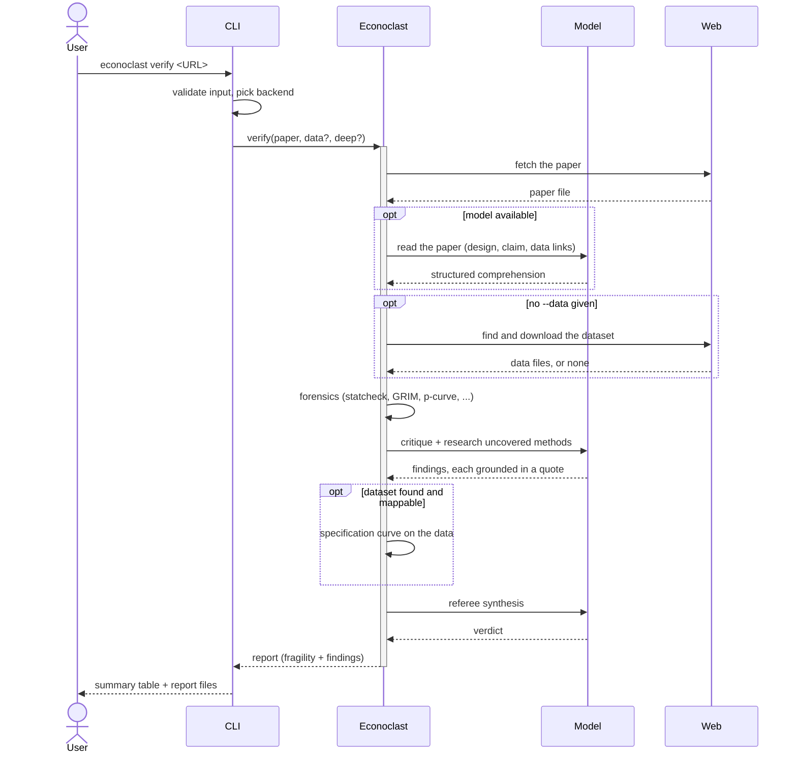
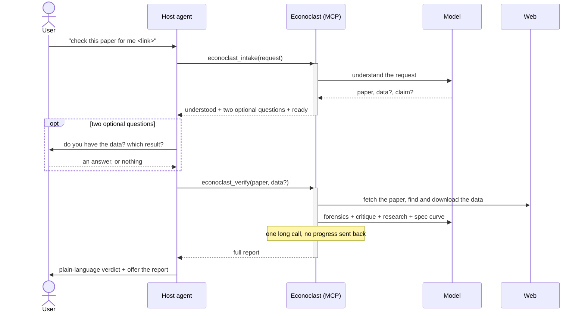
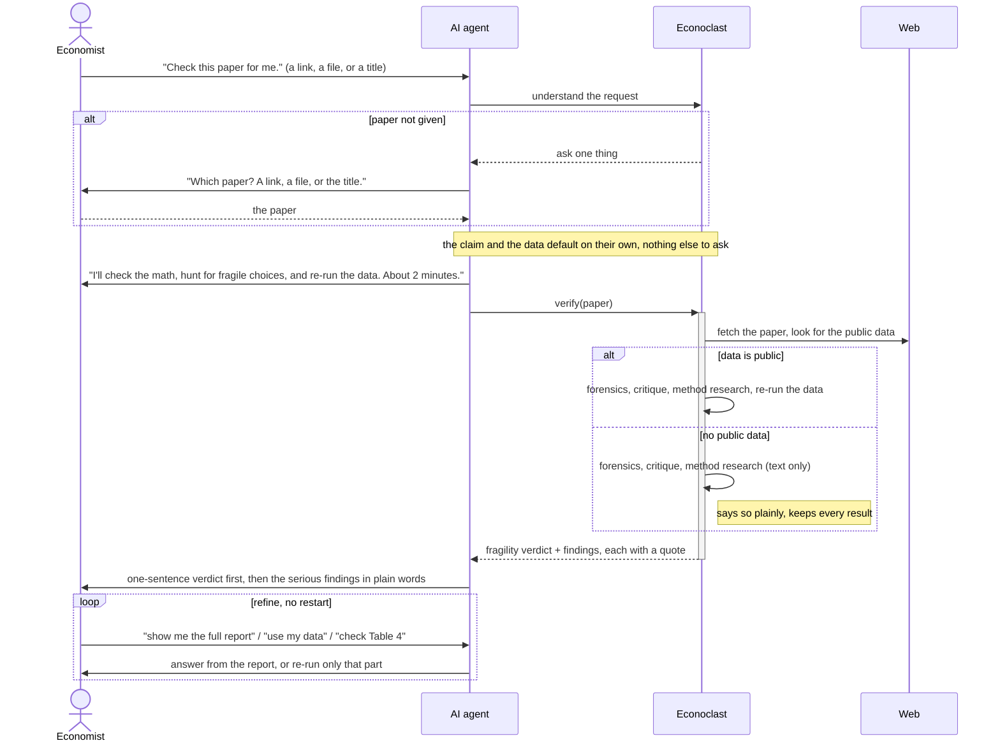

# Interaction design: talk once, get a verdict

This is the product view of how a person actually uses Econoclast, what got in their way, and how the
flow was simplified. The user we design for is an economist who is not technical. They do not want to
run a forensics suite; they want to know whether they can trust a paper's headline result, in language
they understand, with as little work from them as possible. Everything below works backward from that
one sentence.

## How it worked before

There are two entry points: the terminal command, and the conversation inside an AI agent (Claude Code
or Codex). Here is what each one actually did, traced from the code.

### The terminal: `econoclast verify <URL>`

### Inside an AI agent: "check this paper for me"

## Where it hurt

Reading the two traces against the usability literature, the friction clustered in four places.

1. **It asked when it could have just gone.** Even when the paper was in hand, the agent surfaced two
   optional questions (do you have the data, which result), so a user who pasted a complete link still
   got bounced into a question round before any work started. Every extra question is decision time the
   user does not need to spend (Hick's Law) and a gap between their intent and the action that satisfies
   it (Norman's gulf of execution).

2. **The long run was a black box.** `verify` fetches the paper, downloads data, runs the forensics,
   the model critique, the method research, and a full specification curve, then returns once. A
   non-technical user saw a blank pause with no sense of what was happening or how long was left.
   Nielsen-Norman's first heuristic, visibility of system status, says anything past ten seconds needs a
   determinate signal, not a spinner.

3. **Failure was opaque.** The data re-run only happens if a public link is found and downloads and a
   table is detected and the columns can be mapped. Any link in that chain breaking produced a single
   terse note, and the user could not tell which step failed or that the rest of the verdict was still
   sound.

4. **There was no cheap way to adjust.** Wanting to look at one more table, or to supply the dataset
   after the fact, meant re-paying the whole multi-minute pipeline. There was no refine-without-restart,
   which is the workflow equivalent of undo (Nielsen-Norman heuristic three, user control and freedom).

## The redesign

The principle is **default instead of ask, then keep the user in the loop while the work runs.** Four
changes, each tied to the friction above.

- **Proceed on sensible defaults.** Intake now returns a one-line `plan` and a single
  `blocking_question`. Only the paper is ever required. When the paper is known the agent states the
  plan ("I'll check the main result, find the public data, and re-run it, about two minutes") and goes.
  The data and the claim are never gates: the tool downloads the data and defaults to the headline
  result, and the user can correct either in passing.
- **Feedforward before the wait.** The agent says what is about to happen and roughly how long before
  the long call, so the pause is expected rather than read as a stall. This narrows the gulf of
  execution and lowers the perceived wait.
- **Graceful degradation, stated plainly.** When the data is not public, that is not an error. The tool
  returns the full text-based verdict (forensics and critique) and says, in plain words, that it could
  not re-run the data, then offers to add the re-run if the user can share the file. Nothing completed
  is thrown away (Nielsen-Norman heuristic nine).
- **Refine without restart.** After the verdict, follow-ups like "show me the full report" or "what
  about Table 4" are answered from the report already in hand. Only genuinely new input, a dataset file
  or a different claim, triggers a fresh run, and the agent says what changed.

### The flow now

The diagram is deliberately the happy path plus the three branches that matter to the user: the one
question asked only when the paper is missing, the data-found versus no-data split, and the refine loop.
Everything else (backend selection, design gating, grounding, the forensic battery) is detail the
non-technical user should never have to see, and it stays in the engine.
